<p align="center">
  
</p>

# VANTA — Company Profile Website

> **"Own the Dark."**

A responsive, multi-page company profile website for **VANTA**, an independent creative studio,
built with Laravel following the MVC (Model-View-Controller) architecture. ⚡

---

## 1. 📌 Project Title

**VANTA — Company Profile Website**
A Laravel-based, responsive multi-page company profile site demonstrating MVC architecture,
routing, controller logic, and reusable Blade layouts.

---

## 2. 👋 Introduction

### What is a Company Profile Website?

A company profile website is an official online presence that introduces a business to the
public. It typically explains who the company is, what it does, what services or products it
offers, and how to get in touch. Unlike a full e-commerce platform, a company profile site is
mainly informational and brand-focused — its job is to build credibility and first impressions.

### Why businesses need one

- **Credibility.** A professional website signals legitimacy to potential clients and partners.
- **Accessibility.** It gives people a place to learn about the business anytime, without
  needing to contact the company directly.
- **Marketing.** It supports lead generation through calls-to-action, service listings, and
  contact forms.
- **Brand consistency.** It lets a business control how its identity — colors, tone, typography —
  is presented, instead of relying only on third-party platforms.

### Purpose of the project

This project simulates a real freelance/junior-developer scenario: a startup (VANTA) hires a
developer to build its official company profile website. The goal is to apply Laravel's MVC
architecture, proper routing, controller logic, reusable Blade layouts, and responsive design to
produce a working four-page site (Home, About, Services, Contact).

---

## 3. 🎯 Objectives

By the end of this project, the following were accomplished:

✅ Set up a Laravel project following the required folder structure.
✅ Implemented four named routes (`/`, `/about`, `/services`, `/contact`) using `Route::get()`.
✅ Created a single `CompanyController` with one method per page (`home()`, `about()`,
   `services()`, `contact()`), each returning its corresponding Blade view.
✅ Built a reusable Blade layout (`layouts/app.blade.php`) shared by all pages.
✅ Built reusable Blade components for the navigation bar and footer
   (`components/navbar.blade.php`, `components/footer.blade.php`) to avoid duplicating markup.
✅ Designed all four required pages (Home, About, Services, Contact) with the content sections
   specified in the assignment brief.
✅ Applied a consistent, responsive visual identity (VANTA's brand colors, typography, and
   voice) using Tailwind CSS.
✅ Passed dynamic content (services, core values, team members) from the controller into the
   views instead of hardcoding it in Blade, to keep logic and presentation separated.

---

## 4. 🏗️ MVC Architecture

### What is MVC?

MVC stands for **Model–View–Controller**. It is a software design pattern that separates an
application into three interconnected parts:

- **Model** — handles data and business logic (e.g., database records, validation rules).
- **View** — handles what the user sees (HTML/Blade templates).
- **Controller** — sits in between; it receives requests, decides what data is needed, and
  chooses which view to display.

### Why Laravel uses MVC

Laravel uses MVC because it keeps a web application organized as it grows. Instead of mixing
database queries, business logic, and HTML in a single file, each concern lives in its own
layer. This makes the codebase easier to navigate, test, and hand off to other developers — a
new team member can look at `routes/`, `app/Http/Controllers/`, or `resources/views/` and
immediately know what kind of code they'll find there.

### Advantages of MVC in software development

- 🧩 **Separation of concerns** — logic, data, and presentation don't get tangled together.
- ♻️ **Reusability** — views and components (like the navbar/footer here) can be reused across
  pages instead of duplicated.
- 🔧 **Easier maintenance** — a bug in the layout doesn't require touching controller logic, and
  vice versa.
- 🤝 **Team collaboration** — front-end-focused and back-end-focused developers can work on Views
  and Controllers independently.
- 🧪 **Testability** — controllers and business logic can be tested without needing to render HTML.

## 🗺️ Architecture Diagram

The diagram below illustrates VANTA's Laravel request flow — from the browser, through routing
and the controller, to the Blade view, and back as an HTML response:

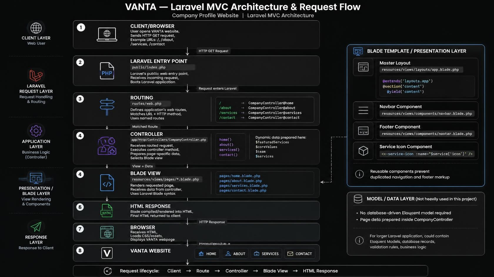

---

## 5. 🛣️ Laravel Routing

### What is Routing?

Routing is how Laravel maps an incoming URL (and HTTP method) to the code that should handle it.
All web routes for this project are defined in `routes/web.php`.

### Named Routes

Each route is given a `->name()`, e.g. `route('home')`, `route('about')`. Named routes let the
Blade views link to pages using `{{ route('contact') }}` instead of hardcoding URLs like
`/contact`. This means if a URL path ever changes, only the route definition needs to be
updated — every `route()` call in the views still works.

### GET Requests

Since all four pages (Home, About, Services, Contact) only need to *display* information, they
are all defined using `Route::get()`, which handles HTTP GET requests — the standard request
type for simply loading a page.

### Route Definitions

```php
Route::get('/', [CompanyController::class, 'home'])->name('home');
Route::get('/about', [CompanyController::class, 'about'])->name('about');
Route::get('/services', [CompanyController::class, 'services'])->name('services');
Route::get('/contact', [CompanyController::class, 'contact'])->name('contact');
```

📸 **Screenshot:** `screenshots/routes.png` — `routes/web.php` showing all four route definitions. ✅

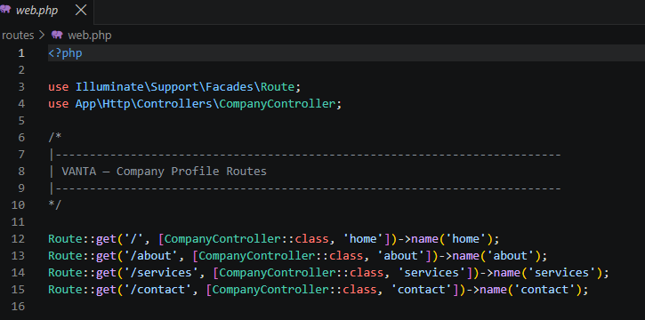

---

## 6. 🎮 Controllers

### Purpose of Controllers

A controller groups related request-handling logic together. Instead of writing logic directly
inside `routes/web.php`, the route simply points to a controller method, keeping the routes file
short and readable.

### Benefits of Controllers

- Keeps route definitions clean — one line per page.
- Groups related actions (all four VANTA pages) under a single, logically named class,
  `CompanyController`.
- Makes it easy to pass data to a view (e.g., the list of services, team members, or core
  values) without cluttering the Blade file with PHP logic.
- Scales well — if the site needed more pages later (e.g., a Blog or Careers page), a new method
  could be added without touching unrelated code.

### Controller Methods

`CompanyController` has one method per page, each returning its corresponding view:

```php
class CompanyController extends Controller
{
    public function home()
    {
        $featuredServices = [ /* ... */ ];
        return view('pages.home', compact('featuredServices'));
    }

    public function about()
    {
        $coreValues = [ /* ... */ ];
        $team = [ /* ... */ ];
        return view('pages.about', compact('coreValues', 'team'));
    }

    public function services()
    {
        $services = [ /* ... */ ];
        return view('pages.services', compact('services'));
    }

    public function contact()
    {
        return view('pages.contact');
    }
}
```

📸 **Screenshots:**
`screenshots/home_controller.png`, `screenshots/about_controller.png`,
`screenshots/services_controller.png`, `screenshots/contact_controller.png` —
`CompanyController.php`, highlighting each method that corresponds to its page. ✅

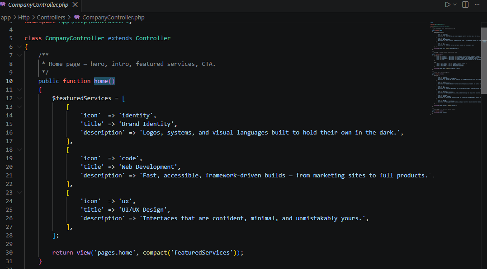
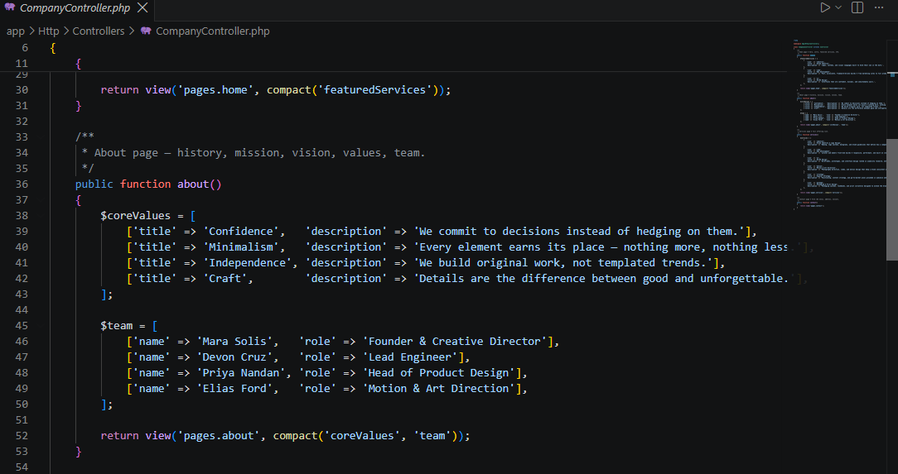
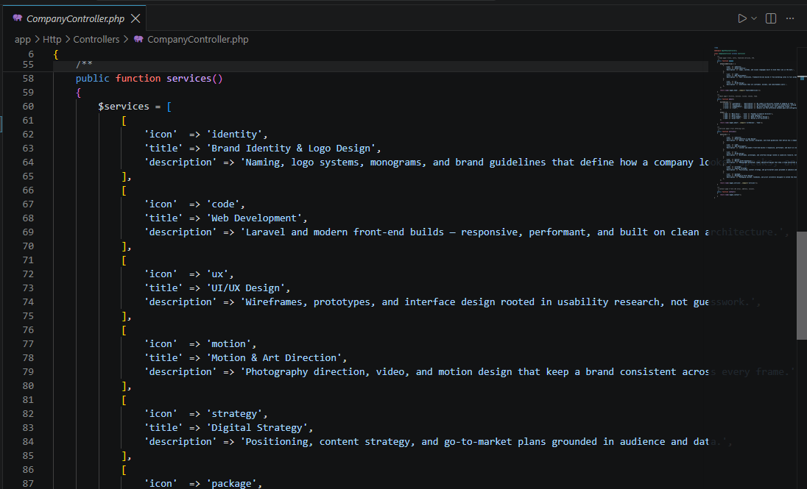
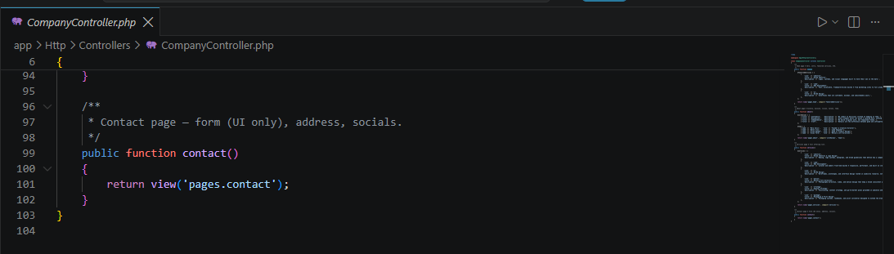

---

## 7. 🔥 Blade Templating Engine

Blade is Laravel's templating engine. It compiles readable, PHP-friendly syntax into plain PHP
behind the scenes, and lets views share layout and components instead of repeating markup.

### Blade Layouts

`resources/views/layouts/app.blade.php` is the master layout — it contains the `<html>`,
`<head>`, font/Tailwind setup, and the shared `<x-navbar />` / `<x-footer />`. Every page extends
this layout instead of rebuilding the page shell from scratch.

### Blade Components

Reusable pieces of UI — the navigation bar, footer, and service icons — are built as Blade
components in `resources/views/components/`:

```blade
<x-navbar />
<x-footer />
<x-service-icon :name="$service['icon']" />
```

This is what fulfills the "do not duplicate navigation and footer code on every page"
requirement — the navbar and footer are written once and simply included on every page.

### @extends

Used at the top of each page (e.g., `pages/home.blade.php`) to declare which layout it inherits:

```blade
@extends('layouts.app')
```

### @section

Defines a named block of content that the page provides to the layout:

```blade
@section('title', 'Home — VANTA')

@section('content')
    <!-- page content -->
@endsection
```

### @yield

Used inside the layout to output the content a page provides for a given section:

```blade
<title>@yield('title', 'VANTA — Own the Dark.')</title>
...
<main>
    @yield('content')
</main>
```

### @include

Used to pull in a Blade partial inline (an alternative to components for simpler includes).
While this project mainly uses `<x-navbar />` / `<x-footer />` (auto-discovered Blade
components), the same result could be achieved with:

```blade
@include('components.navbar')
```

📸 **Screenshot:** `screenshots/blades.png` — Blade layout/component files in the editor. ✅

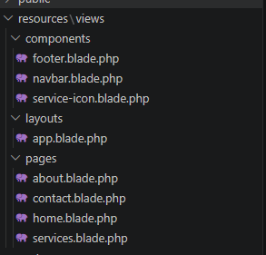

---

## 8. 📂 Laravel Folder Structure

| Folder | Purpose |
|---|---|
| `app/` | Contains the application's core code — in this project, `app/Http/Controllers/CompanyController.php`, which holds all page logic. |
| `routes/` | Contains route definition files. `web.php` maps URLs to controller methods for this project. |
| `resources/` | Contains uncompiled assets and Blade views — `resources/views/layouts`, `components`, and `pages` hold all the front-end templates. |
| `public/` | The web server's entry point and public assets — includes `index.php` (Laravel's front controller) and this project's `public/css/app.css`. |
| `bootstrap/` | Contains files that bootstrap the framework on every request (e.g., `bootstrap/app.php`) and the framework's cache files. Developers rarely edit this directly. |
| `config/` | Contains all of the application's configuration files (database, mail, services, etc.), letting settings be managed centrally instead of scattered across the codebase. |

📸 **Screenshot:** `screenshots/vscode.png` — full project folder structure in VS Code. ✅

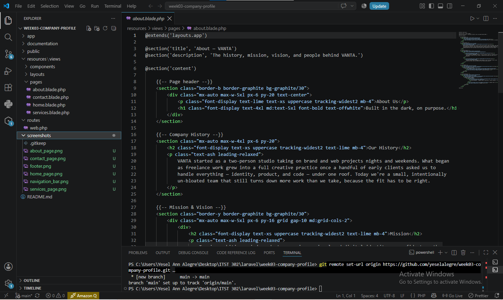

---

## 9. 📸 Screenshots

### Home Page
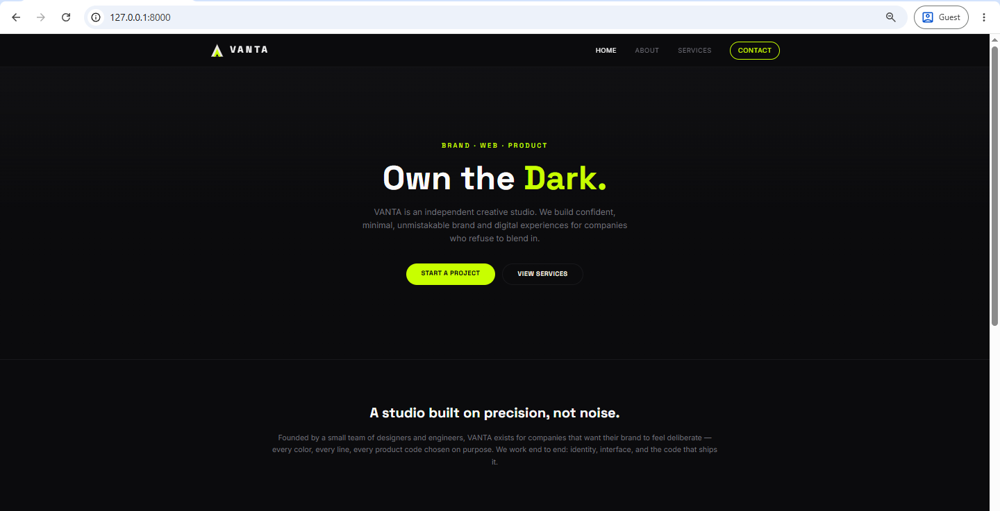

### About Page
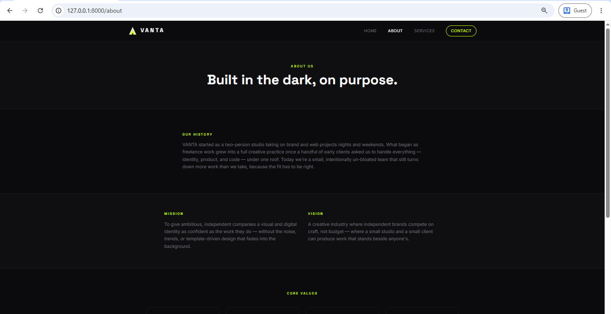

### Services Page
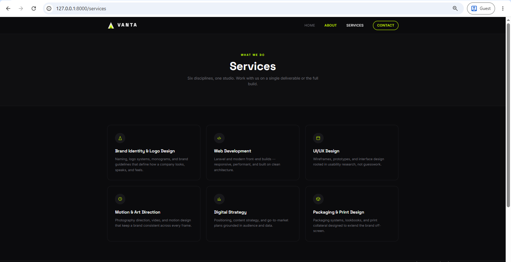

### Contact Page
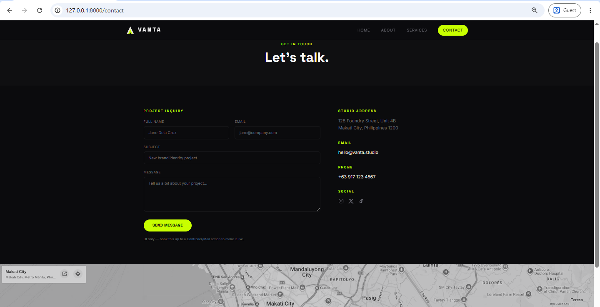

### Navigation Bar


### Footer


### Route Definitions


### Controller


### Blade Layout


---

## 10. 🐛 Problems Encountered

1. **View not found error.** Early on, `view('pages.home')` returned a "View not found"
   exception because the file was saved as `home.blade.php.blade.php` (a duplicate extension)
   inside `resources/views/pages/`.
2. **Route not found / `route()` helper errors.** Links using `{{ route('services') }}` failed
   before the `->name('services')` chain was added to the route definition in `web.php`, since
   Blade's `route()` helper depends on named routes existing.
3. **Blade component not rendering (`<x-navbar />` not found).** Laravel's anonymous component
   auto-discovery expects components inside `resources/views/components/`. The navbar briefly
   failed to render because it was placed directly in `resources/views/` instead of the
   `components/` subfolder.
4. **Controller namespace/autoload issue.** After creating `CompanyController.php` manually
   (instead of via `php artisan make:controller`), Laravel initially threw a "Class not found"
   error because the `namespace App\Http\Controllers;` declaration didn't match the file's
   actual folder location.

---

## 11. 🛠️ Solutions

1. Renamed the file to the correct single extension, `home.blade.php`, and confirmed Laravel's
   dot notation (`pages.home`) correctly mapped to `resources/views/pages/home.blade.php`.
2. Added `->name()` to every route in `web.php` (`->name('home')`, `->name('about')`, etc.), then
   cleared Laravel's route cache with `php artisan route:clear` to confirm the named routes were
   registered.
3. Moved `navbar.blade.php` and `footer.blade.php` into `resources/views/components/`, which
   Laravel auto-discovers for `<x-navbar />` / `<x-footer />` syntax without any manual
   registration.
4. Verified the file path matched the namespace exactly (`app/Http/Controllers/CompanyController.php`
   ↔ `namespace App\Http\Controllers;`), then ran `composer dump-autoload` to refresh Composer's
   autoload map so Laravel could locate the class.

---

## 12. 💭 Reflection 

Building VANTA's company profile site was my first time applying Laravel's MVC architecture to a
complete, multi-page project rather than a single isolated exercise, and it changed how I think
about structuring a web application.

The biggest thing I learned about MVC is that it isn't just a folder convention — it's a way of
enforcing discipline about *where logic belongs*. Before this project, I would have been tempted
to put everything in one place: query-like arrays, HTML, and routing logic all mixed together in
a single file. Working with Laravel forced me to ask, for every piece of code, "is this a route's
job, a controller's job, or a view's job?" Routes only decide *which* controller method handles a
URL. Controllers decide *what data* a page needs and *which view* renders it. Views only decide
*how* that data is displayed. Once I internalized that split, features became much easier to
reason about — when the Services page needed a sixth service, I only had to add an array item in
the controller; I never had to touch the Blade file at all.

That experience is really what "separation of concerns" means in practice. It's not an abstract
principle — it's the reason a bug in my footer styling never risked breaking the contact form
logic, and the reason I could change VANTA's brand colors sitewide by editing one Tailwind config
block instead of every page. Separation of concerns also made the codebase safer to hand off:
anyone opening this project can guess, correctly, that `routes/web.php` defines URLs,
`CompanyController.php` defines page logic, and `resources/views/` defines what the user
actually sees — without reading a single line of documentation.

Seeing routes, controllers, and views work together end-to-end also made the request lifecycle
click for me in a way that reading about it never did. A browser request hits a route; the route
hands off to a controller method; the controller gathers or prepares data (like the `$services`
array) and passes it into a view using `compact()`; the Blade view renders that data into HTML
using directives like `@foreach`, `@extends`, and `@section`; and that HTML is what gets sent
back to the browser. Watching that chain actually execute — and watching it break in predictable,
diagnosable ways when I misnamed a route or misplaced a file — taught me more about the pattern
than any diagram could.

I can see this same architecture scaling far beyond a four-page profile site. In a larger
enterprise system, the "Model" layer I didn't heavily use here (since this project has no
database) would hold Eloquent models and business rules; controllers would grow into thin
coordinators calling services and repositories instead of holding logic directly; and views would
be broken into even more granular, reusable Blade components. The core lesson — that a system
built on separated, well-defined layers is easier to extend, test, and maintain than one built as
a single tangled file — applies whether you're building four pages or four hundred.

---

## 13. 📚 References

APA 7th Edition:

Laravel. (n.d.). *Laravel documentation*. Laravel. https://laravel.com/docs

PHP Group. (n.d.). *PHP: Hypertext preprocessor manual*. PHP Documentation. https://www.php.net/docs.php

Mozilla Developer Network. (n.d.). *MDN Web Docs*. Mozilla. https://developer.mozilla.org

Tailwind Labs. (n.d.). *Tailwind CSS documentation*. Tailwind CSS. https://tailwindcss.com/docs

---

## 🚀 Setup

```bash
composer create-project laravel/laravel week03-company-profile
cd week03-company-profile
```

Copy this project's `routes/`, `app/`, `resources/`, and `public/css/app.css` into the newly
created project (overwriting the defaults), then:

```bash
php artisan serve
```

Visit `http://127.0.0.1:8000` and own the dark. 